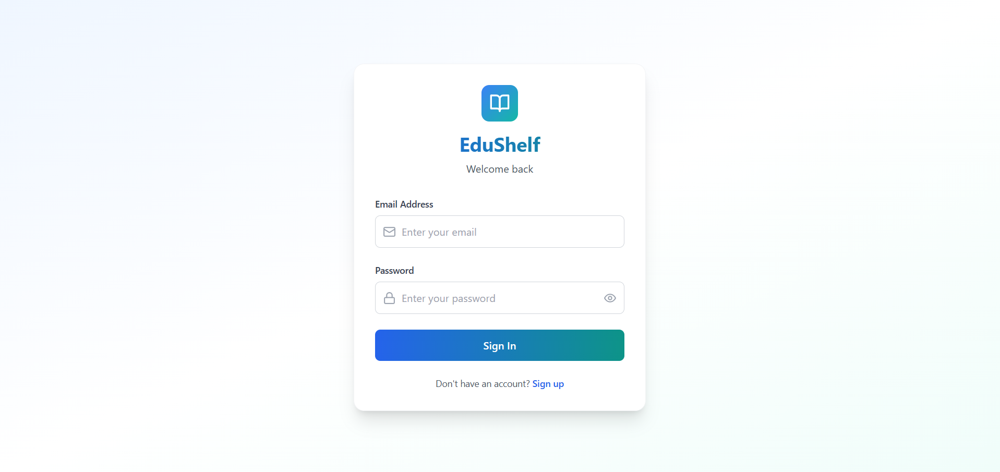
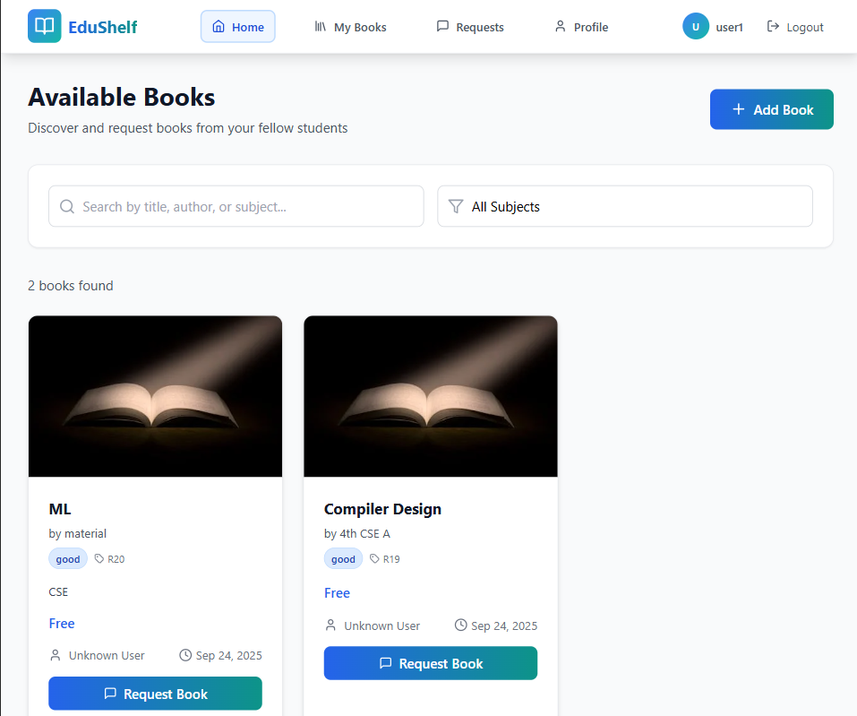
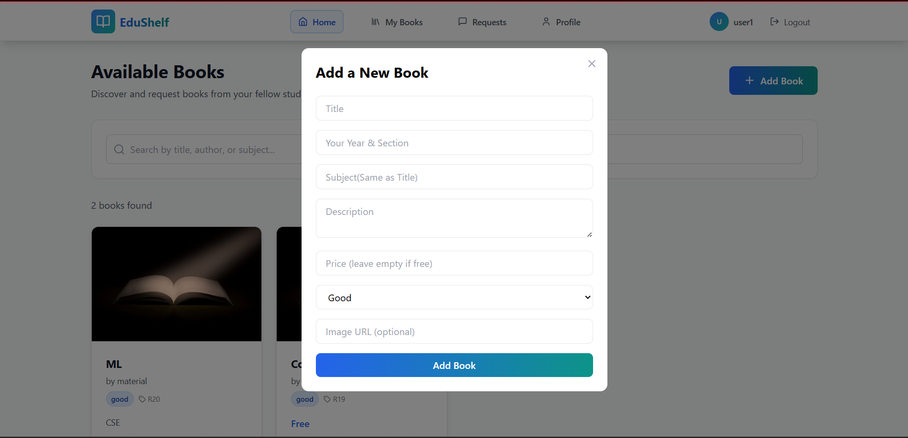

# EduShelf

EduShelf is a serverless book exchange platform designed to bridge the gap between seniors, juniors, and students. Built with React, TypeScript, Tailwind CSS, and Firebase, EduShelf enables academic communities to share, exchange, and request books in a secure, real-time environment—making it easy for different academic levels to connect and support each other, all without the need for a backend server.

---

## Table of Contents

- [Project Description](#project-description)
- [Screenshots](#screenshots)
- [Features](#features)
- [Tech Stack](#tech-stack)
- [Folder Structure](#folder-structure)
- [Setup & Installation](#setup--installation)
- [Usage](#usage)
- [Future Enhancements](#future-enhancements)
- [License](#license)

---

## Project Description

EduShelf is developed to foster connections and resource-sharing between seniors, juniors, and students. The platform makes it easy to:

- **Sign up or log in securely** via Firebase Authentication.
- **Post books for exchange or request** with details like title, author, price, and description.
- **Browse available books** and filter/search by subject, year, or author—helping you find materials shared by seniors, juniors, or peers.
- **Manage your own book listings** — edit or delete entries as your academic needs change.

### Why serverless?

- Firebase handles authentication, database, and security rules.
- Real-time updates and offline support without a backend.
- Perfect for fostering academic community exchanges, small-scale applications, or hackathon prototypes.

---

## Screenshots

### Login Page


### Book Discovery & Request


### Add a New Book


---

## Features

- **User Authentication** (Sign-up / Login / Logout)
- **Book Management** (Add, Edit, Delete listings)
- **Search & Filter** by subject, year, author, or price to find resources from seniors, juniors, or fellow students
- **Role-based Access** (Users can only edit their own listings)
- **Real-time Database Updates**
- **Responsive UI** with Tailwind CSS and shadcn/ui components

---

## Tech Stack

**Frontend:**
- React (component-based framework)
- TypeScript (type safety & scalability)
- Tailwind CSS (responsive, utility-first styling)
- shadcn/ui (prebuilt UI components)
- lucide-react (icons)

**Backend / Database:**
- Firebase Firestore (NoSQL, real-time DB)
- Firebase Authentication (secure login & signup)
- Firebase Security Rules (access control, role-based restrictions)

**Extras / Dev Tools:**
- GitHub for version control
- Vite for frontend bundling and fast dev server

---

## Folder Structure

```
EduShelf/
├─ src/
│  ├─ components/
│  │  ├─ Auth/
│  │  │  └─ AuthForm.tsx
│  │  ├─ Books/
│  │  │  ├─ AddBook.tsx
│  │  │  └─ BookCard.tsx
│  │  └─ Layout/
│  │     └─ Navbar.tsx
│  ├─ Views/
│  │  ├─ HomeView.tsx
│  │  ├─ MyBooksView.tsx
│  │  ├─ ProfileView.tsx
│  │  └─ RequestsView.tsx
│  ├─ contexts/
│  │  └─ AuthContext.tsx
│  ├─ lib/
│  │  ├─ firebase.ts
│  │  ├─ supabase.txt
│  │  └─ index.css
│  ├─ App.tsx
│  ├─ main.tsx
│  └─ vite-env.d.ts
├─ supabase/
├─ .env
├─ .gitignore
├─ eslint.config.js
├─ index.html
├─ package-lock.json
└─ package.json
```

---

## Setup & Installation

**1. Clone the repository**
```bash
git clone https://github.com/Satwikindupuri/EduShelf.git
cd EduShelf
```

**2. Install dependencies**
```bash
npm install
```

**3. Set up Firebase**
- Create a Firebase project at [Firebase Console](https://console.firebase.google.com)
- Enable Firestore and Authentication
- Replace your config in `src/lib/firebase.ts`

**4. Start the development server**
```bash
npm run dev
```

**5. Build for production**
```bash
npm run build
```

---

## Usage

- Register / Login as a senior, junior, or student
- Add a new book for exchange or request in the Add Book section
- Browse books in the Books page shared by your academic peers
- Edit or delete your listings from the Seller Dashboard as your needs change
- Search and filter books by subject, year, or author, discovering resources from across student groups

---

## Future Enhancements

- Add a chat system for communication between seniors, juniors, and students
- Implement book recommendations based on academic interests and study level
- Integrate payment gateway for secure transactions
- Scale database with backend server + MongoDB for analytics

---

## License

This project is open source under the MIT License.